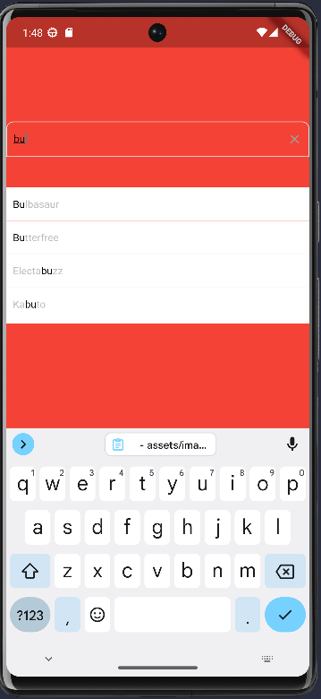
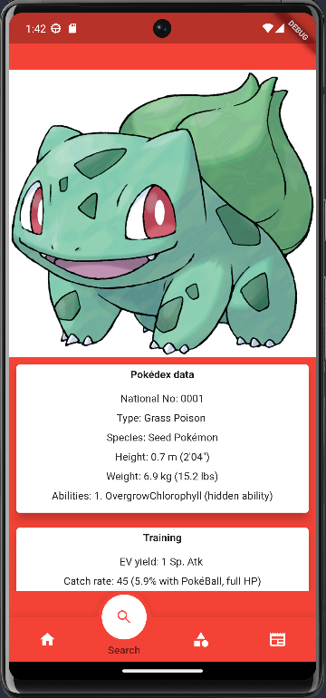
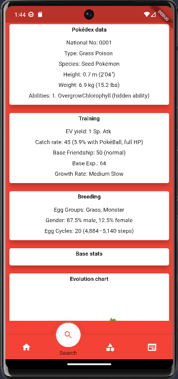
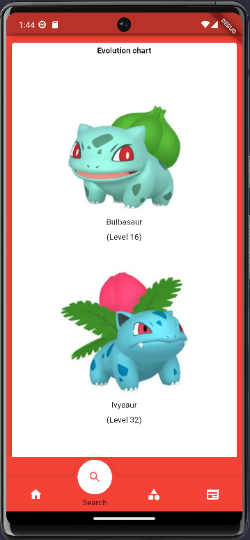
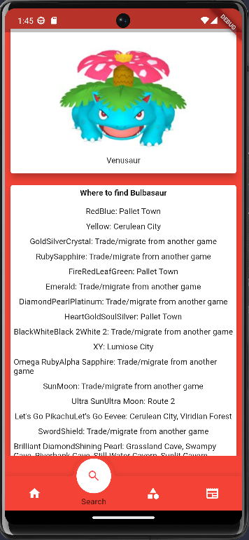
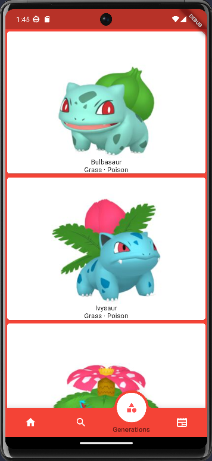
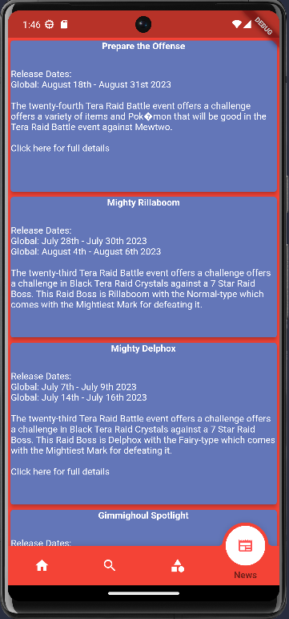

# Pokedex

A comprehensive Flutter application designed to be a practical companion for playing Pokémon games. This project showcases various Flutter features while providing useful functionality for Pokémon trainers.

## Features

### Search Functionality
Advanced search capabilities to find Pokémon, moves, and abilities quickly.







### Pokedex Functionality
Browse and explore detailed Pokémon information including stats, types, and evolutions.



### Terra Raids Information
Stay updated with current Terra Raid information and boss details.



## Getting Started

### Prerequisites
- Flutter SDK (2.18.6 or higher)
- Dart SDK
- A code editor (VS Code, Android Studio, or IntelliJ IDEA)
- Firebase account (for backend features)

### Installation

1. Clone the repository:
   ```bash
   git clone https://github.com/yourusername/pokedex.git
   cd pokedex
   ```

2. Install dependencies:
   ```bash
   flutter pub get
   ```

3. Set up Firebase:
   - Create a new Firebase project at [Firebase Console](https://console.firebase.google.com/)
   - Add your app to the Firebase project (Android, iOS, and/or macOS)
   - Download the configuration files:
     - Android: `google-services.json` → place in `android/app/`
     - iOS: `GoogleService-Info.plist` → place in `ios/Runner/`
     - macOS: `GoogleService-Info.plist` → place in `macos/Runner/`
   - Enable Cloud Firestore in your Firebase project

4. Generate required files:
   ```bash
   flutter pub run build_runner build
   ```

5. Run the app:
   ```bash
   flutter run
   ```

## Dependencies

Key packages used in this project:
- `firebase_core` & `cloud_firestore` - Backend database
- `hive` & `hive_flutter` - Local storage
- `cached_network_image` - Image caching
- `flutter_widget_from_html` - HTML rendering
- `advanced_search` - Enhanced search functionality
- `fancy_bottom_navigation_2` - Bottom navigation UI

See [pubspec.yaml](pubspec.yaml) for the complete list.

## Building for Release

### Android
```bash
flutter build apk --release
# or
flutter build appbundle --release
```

### iOS
```bash
flutter build ios --release
```

### macOS
```bash
flutter build macos --release
```

**Note:** For production releases, configure proper signing certificates for your target platform.

## Project Structure

```
lib/
├── models/          # Data models (Hive objects)
├── services/        # API and business logic services
└── Widgets/         # UI components and screens
```

## Contributing

Contributions are welcome! Please feel free to submit a Pull Request.

## License

This project is licensed under the MIT License - see the [LICENSE](LICENSE) file for details.

## Acknowledgments

- Pokémon data sourced from [PokéAPI](https://pokeapi.co/)
- Additional data from [PokemonDB](https://pokemondb.net/)

## Disclaimer

This is an unofficial fan-made application. Pokémon and Pokémon character names are trademarks of Nintendo.