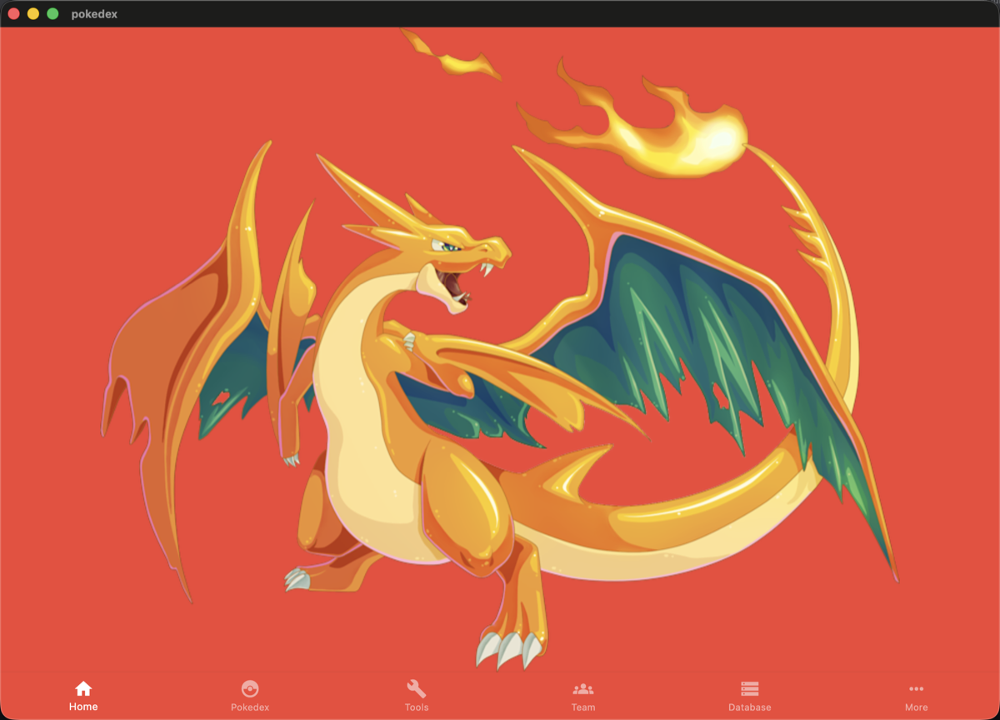
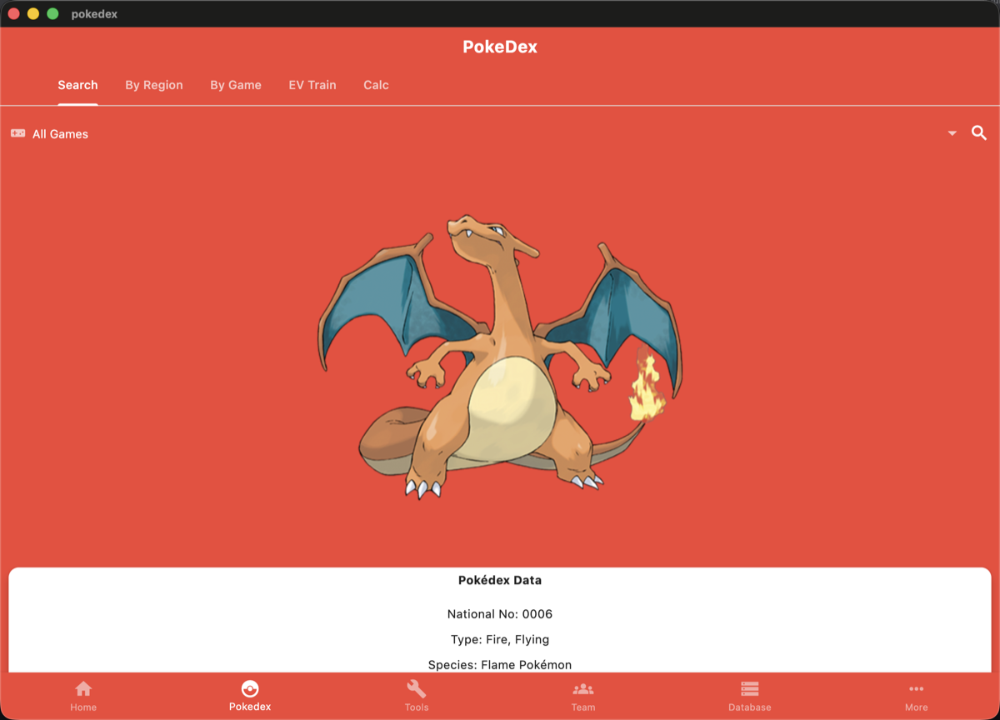
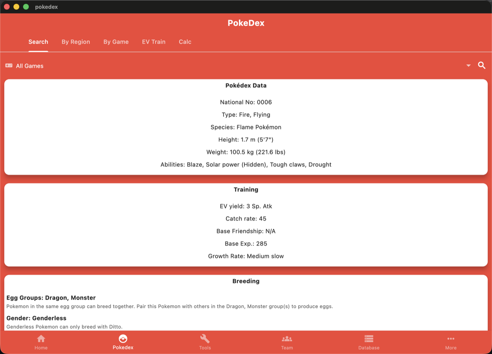
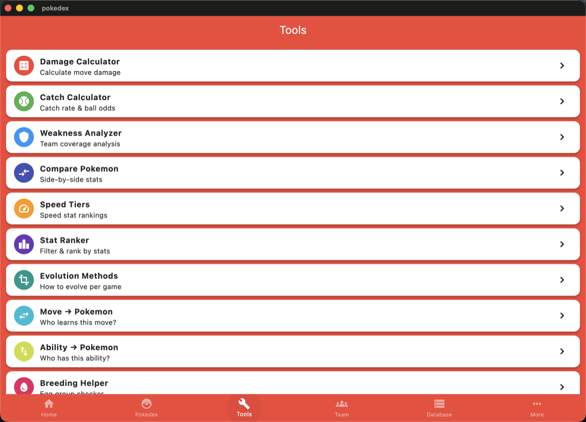
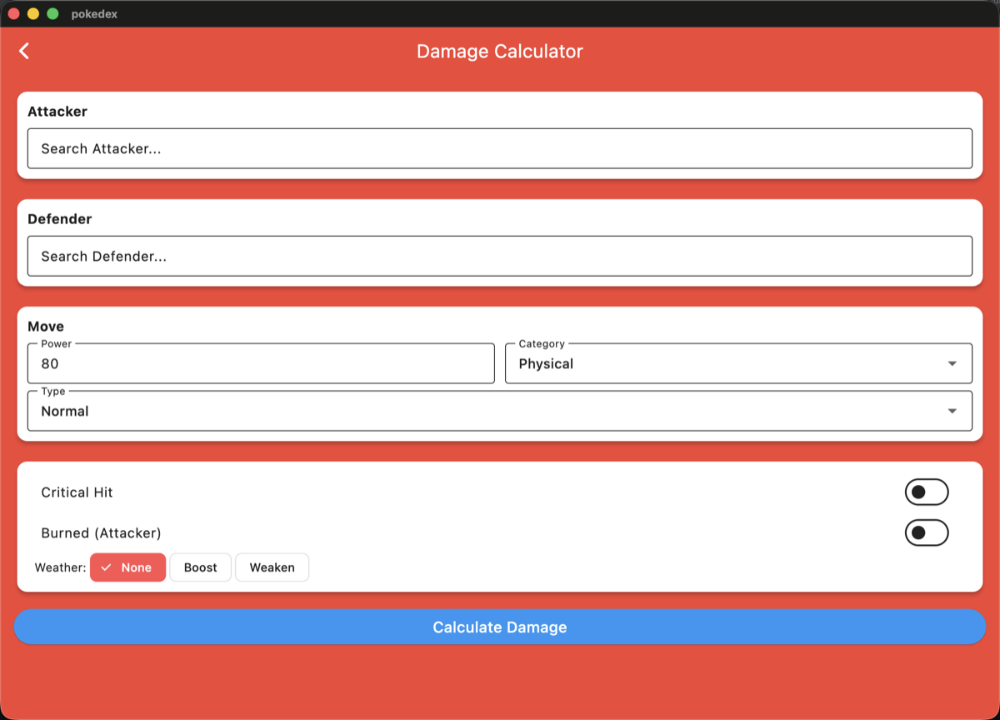
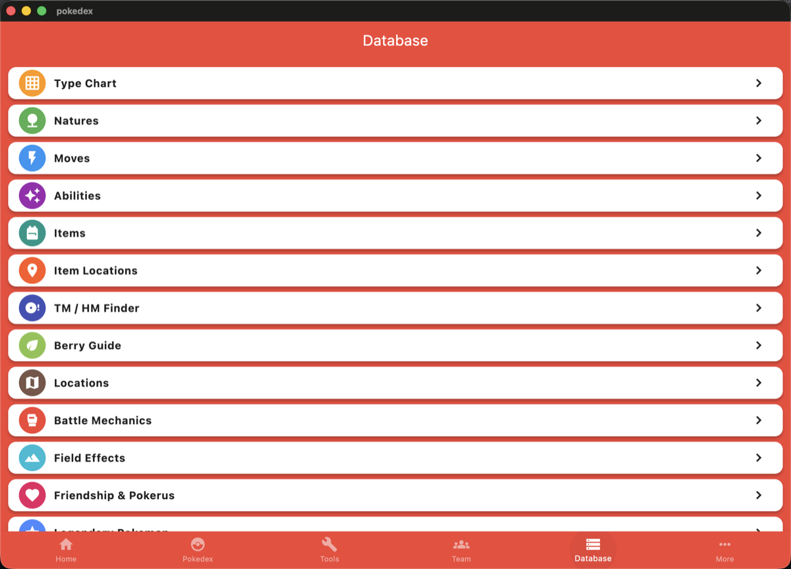
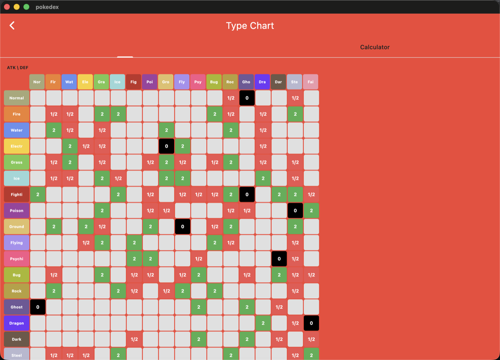
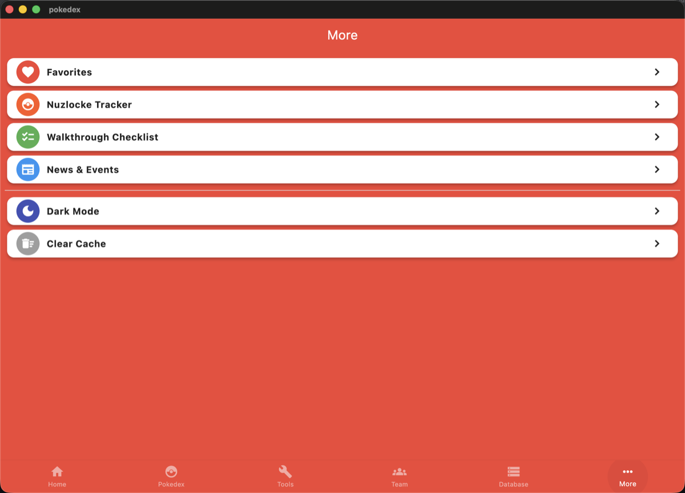

# Pokedex

A Flutter companion app for playing Pokémon games — team building, type coverage, damage math, and move lookup across every generation.

Built for the second screen while you play: look up what a Pokémon learns, work out whether a hit KOs, check what your team is weak to, or track a Nuzlocke run.



## Features

### Pokédex

Search all 1025 Pokémon, filtered by game or region. Every entry pulls full species data — typing, abilities, base stats, EV yield, catch rate, growth rate, egg groups, evolution methods, held items and game locations.




### Tools

Damage calculator, catch calculator, weakness analyzer, side-by-side comparison, speed tiers, stat ranker, evolution methods, reverse move/ability lookup, breeding helper, IV and EV calculators, and a shiny odds calculator.



The damage calculator handles STAB, type effectiveness, critical hits, burn, and weather:



### Databases

Full reference tables for types, natures, moves, abilities, items, item locations, TM/HM sources, berries, locations, battle mechanics, field effects, friendship & Pokérus, and legendaries.



The type chart covers all 18 types both offensively and defensively:



### Team & tracking

Save Pokémon with their IVs and natures, track a Nuzlocke run, keep a walkthrough checklist, and mark favorites.



## Getting Started

### Prerequisites

- Flutter SDK 3.0 or higher (Dart SDK `>=3.0.0 <4.0.0`)
- A code editor (VS Code, Android Studio, or IntelliJ IDEA)

### Installation

```bash
git clone https://github.com/N0tT1m/pokedex.git
cd pokedex
flutter pub get
flutter run
```

That's it — there is no backend to configure for local development.

### API backend

By default the app talks to a hosted API that proxies [PokéAPI](https://pokeapi.co/) and adds scraped biology text, held items and game locations:

```
https://poke-api.duocore.dev:158/api/v2
```

This is a personal server with no uptime guarantee. Point the app at your own instance (or directly at PokéAPI) with a compile-time variable:

```bash
flutter run --dart-define=POKEDEX_API_BASE_URL=https://pokeapi.co/api/v2
```

Endpoints beyond the standard PokéAPI surface (`/pokemon/{id}/biology`, `/held-items`, `/game-locations`) will return no data when pointed at PokéAPI directly; the rest of the app works normally.

## Building for Release

```bash
flutter build apk --release          # Android
flutter build appbundle --release    # Android (Play Store)
flutter build ios --release          # iOS
flutter build macos --release        # macOS
flutter build web --release          # Web
```

**Note:** Configure signing certificates for your target platform before shipping a production build.

## Testing

```bash
flutter test
flutter analyze
```

## Project Structure

```
lib/
├── data/            # Static game data tables
├── models/          # Data models (Hive objects)
├── services/        # API clients and calculation logic
└── Widgets/
    ├── databases/   # Reference table screens
    ├── nuzlocke/    # Nuzlocke run tracker
    ├── pokemon/     # Pokémon detail screens
    └── tools/       # Calculators and lookups
test/                # Unit tests for calculation services
```

The battle math (type effectiveness, damage, IV/EV, catch rate, shiny odds) lives in `lib/services/` and is unit-tested against known reference values.

## Dependencies

Key packages:

- `hive` & `hive_flutter` — local storage for saved Pokémon and run state
- `cached_network_image` — sprite caching
- `flutter_widget_from_html` — rendering scraped HTML content
- `advanced_search` — search field with suggestions
- `fancy_bottom_navigation_2` — bottom navigation
- `requests`, `html` — HTTP and HTML parsing

See [pubspec.yaml](pubspec.yaml) for the full list.

## Contributing

Contributions are welcome — please open a pull request. Run `flutter analyze` and `flutter test` before submitting.

## License

MIT — see [LICENSE](LICENSE).

## Acknowledgments

- Pokémon data from [PokéAPI](https://pokeapi.co/)
- Additional data from [PokémonDB](https://pokemondb.net/) and [Bulbapedia](https://bulbapedia.bulbagarden.net/)

## Disclaimer

This is an unofficial fan-made application, not affiliated with or endorsed by Nintendo, Game Freak, or The Pokémon Company. Pokémon and Pokémon character names are trademarks of Nintendo.
